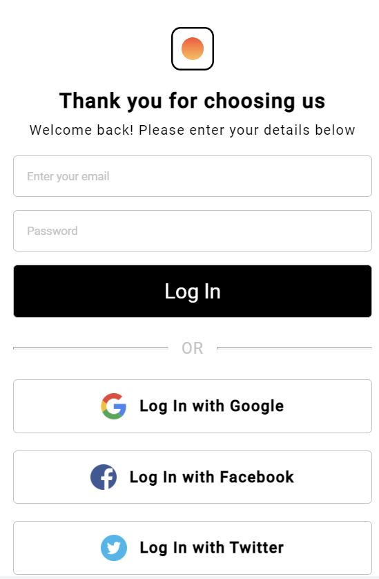

## Thank you for joining Web Developer Mentor community! 🙏

&nbsp;

### What to do when you completed the challenge?

First you need to make your challenge visible to others. Yoy can do so by uploading it to one of the free static hosting providers. Below is the list of the most popular ones:

-   [Netlify](https://loginscreenaljok.netlify.app/) - recommended
-   [GitHub Solutin](https://github.com/aldijoko/login-screen)

### How to submit your solution to WebDeveloperMentor

In order to submit your solution please follow these steps:

1. Go to 'Web developer mentor' [submit challenge solution page](https://webdevelopermentor.com/solution/create)
2. Click 'Submit Solution' button next to the challenge.

You will be prompted to enter Title, Github repoitory URL, Live preview URL (can be Netlify, Vercel, Github Pages or even your own server), and tell the community what challenges you've faced.

## Overview

### Desktop Design

### Mobile Design

